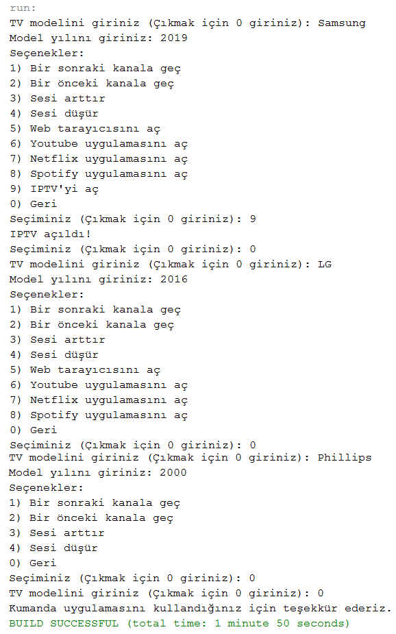

= Liskov Substitution Principle

== Tanım

Alt seviye sınıflardan oluşan nesnelerin/sınıfların, üst(ana) sınıfın nesneleri ile yer değiştirdikleri zaman, aynı davranışı sergilemesi gerekmektedir. Türetilen sınıflar, türeyen sınıfların tüm özelliklerini kullanabilmelidir. 

== Amaç

Kodlarımızda herhangi bir değişiklik yapmaya gerek duymadan alt sınıfları, üst sınıfların yerine, yani türetildikleri sınıfların yerine kullanabilmeliyiz.

Türeyen sınıf, yani alt sınıflar, üst(ana) sınıfın tüm özelliklerini ve metotlarını aynı işlevi gösterecek şekilde kullanabilme ve kendine ait yeni özellikler barındırabilmelidir.

== Örnek

Bir araba arayüzü düşünelim. Arabaların yetenekleri bu arayüzde tanımlanmış olsun. Örnek olarak klima açma yeteneği de bu arayüzde tanımlanmış olsun. Bir çok arabanın kliması vardır. Ancak eski model arabaların bazılarında bu özellik yoktur. Eski model arabanın sınıfı, araba arayüzünü implement ettiği için klima açma metodunu override etmek zorunda. Ama bu eski model aracın böyle bir yeteneği yok.

Bu sorunu oluşan error'u handle ederek çözebiliriz. Ancak bu doğru bir yaklaşım değildir. Bunun gibi bir durum çok büyük bir projede oluşursa, bir başka yazılımcı bu kodu kullanmak isterse hiç hoş olmayan durumlarla karşılaşabilir. Veya açık kaynak bir projede üçüncü bir şahıs bu kodu kullanmak isterse sorunlarla karşılaşabilir. Bu sebeple içinde bulunduğumuz duruma göre tasarımı doğru bir şekilde yapmalıyız. 

== Kendi Projemde LSP Kullanımı

Yeni çıkan bazı telefon modellerinde kızılötesi sinyal verici bulunmaktadır. Bu donanımı televizyonları kumanda etmek için kullanabilmekteyiz. Benim telefonumda da böyle bir özellik bulunmakta. Bu özelliği test etme imkanım oldu. Kullanım sonucunda şöyle bir sorun fark ettim; Uygulamanın bana sunduğu arayüzde, aslında televizyonumda olmayan özellikler için butonlar yer alıyordu.

Bu sorunu Liskov Substitution Prensibi ile çözecek bir proje geliştirdim. Bu projede yer alan arayüzler ve sınıflar aşağıda gösterilmektedir.

=== UML Class Diagram

[plantuml, liskov-uml-class-diagram, png]
--
@startuml

interface IRemoteControl{
    + nextChannel(): void
    + previousChannel(): void
    + increaseVolume(): void
    + decreaseVolume(): void
}

interface ISmartTV{
    + openWebBrowser(): void
    + openYoutube(): void
    + openNetflix(): void
    + openSpotify(): void
}

interface IIPTV{
    + openIPTV(): void
}

class RemoteControl{
    + nextChannel(): void
    + previousChannel(): void
    + increaseVolume(): void
    + decreaseVolume(): void
}

class RemoteControlWithSmartTV{
    + nextChannel(): void
    + previousChannel(): void
    + increaseVolume(): void
    + decreaseVolume(): void
    + openWebBrowser(): void
    + openYoutube(): void
    + openNetflix(): void
    + openSpotify(): void
}

class RemoteControlWithSmartTVandIPTV{
    + nextChannel(): void
    + previousChannel(): void
    + increaseVolume(): void
    + decreaseVolume(): void
    + openWebBrowser(): void
    + openYoutube(): void
    + openNetflix(): void
    + openSpotify(): void
    + openIPTV(): void
}

class LiskovSubstitutionPrinciple{
    - model: String
    - year: int
    
}

RemoteControl ..|> IRemoteControl
RemoteControlWithSmartTV ..|> IRemoteControl
RemoteControlWithSmartTV ..|> ISmartTV
RemoteControlWithSmartTVandIPTV ..|> IRemoteControl
RemoteControlWithSmartTVandIPTV ..|> ISmartTV
RemoteControlWithSmartTVandIPTV ..|> IIPTV
LiskovSubstitutionPrinciple "<<use>>" ..> RemoteControl
LiskovSubstitutionPrinciple "<<use>>" ..> RemoteControlWithSmartTV
LiskovSubstitutionPrinciple "<<use>>" ..> RemoteControlWithSmartTVandIPTV

@enduml
--

=== Arayüzlerin ve Sınıfların Java ile Gerçekleştirilmesi

İlk arayüz, tüm televizyonlarda bulunan en basit fonksiyonları tanımlayan IRemoteControl adında bir arayüzdür. 

[source, java]
----
public interface IRemoteControl {
    public void nextChannel();
    public void previousChannel();
    public void increaseVolume();
    public void decreaseVolume();
}
----

SmartTV özelliğini destekleyen televizyonlar için ISmartTV adında bir arayüz bulunmaktadır.

[source, java]
----
public interface ISmartTV {
    public void openWebBrowser();
    public void openYoutube();
    public void openNetflix();
    public void openSpotify();
}
----

IPTV özelliğini destekleyen televizyonlar için IIPTV adında bir arayüz bulunmaktadır.

[source, java]
----
public interface IIPTV {
    public void openIPTV();
}
----

Kullanıcıdan input alıyorum. Temsili olması için televizyon modelinin yılını, televizyonun yeteneklerini belirlemek için kullandım. Televizyonlar için hepsinde olmayan iki özellik belirledim: SmartTV ve IPTV. Bu iki özellik için de şu şekilde bir filtre uyguladım: 2012 yılından önce üretilmiş televizyonlar, sadece temel televizyon özelliklerini gösteriyor. Bu sebeple sadece temel televizyon arayüzünü implement ediyor.

[source, java]
----
public class RemoteControl implements IRemoteControl {

    @Override
    public void nextChannel() {
        System.out.println("Bir sonraki kanala geçildi!");
    }

    @Override
    public void previousChannel() {
        System.out.println("Bir önceki kanala geçildi!");
    }

    @Override
    public void increaseVolume() {
        System.out.println("Ses arttırıldı!");
    }

    @Override
    public void decreaseVolume() {
        System.out.println("Ses azaltıldı!");
    }

}
----

2012 ile 2017 yılları arasında üretilmiş televizyonlar, temel özelliklerin yanında SmartTV özelliğini de içeriyor. Bu sebeple hem temel televizyon arayüzünü hem de SmartTV arayüzünü implement ediyor.

[source, java]
----
public class RemoteControlWithSmartTV implements IRemoteControl,ISmartTV{

    @Override
    public void nextChannel() {
        System.out.println("Bir sonraki kanala geçildi!");
    }

    @Override
    public void previousChannel() {
        System.out.println("Bir önceki kanala geçildi!");
    }

    @Override
    public void increaseVolume() {
        System.out.println("Ses arttırıldı!");
    }

    @Override
    public void decreaseVolume() {
        System.out.println("Ses azaltıldı!");
    }

    @Override
    public void openWebBrowser() {
        System.out.println("Web tarayıcısı açıldı!");
    }

    @Override
    public void openYoutube() {
        System.out.println("Youtube uygulaması açıldı!");
    }

    @Override
    public void openNetflix() {
        System.out.println("Netflix uygulaması açıldı!");
    }

    @Override
    public void openSpotify() {
        System.out.println("Spotify uygulaması açıldı!");
    }
    
}
----

2017 yılından sonra üretilmiş televizyonlar ise, temel özelliklerin yanında SmartTV ve IPTV özelliklerini de içeriyor. Bu sebeple hem temel televizyon arayüzünü hem de SmartTV ve IPTV arayüzlerini implement ediyor.

[source, java]
----
public class RemoteControlWithSmartTVandIPTV implements IRemoteControl, ISmartTV, IIPTV{

    @Override
    public void nextChannel() {
        System.out.println("Bir sonraki kanala geçildi!");
    }

    @Override
    public void previousChannel() {
        System.out.println("Bir önceki kanala geçildi!");
    }

    @Override
    public void increaseVolume() {
        System.out.println("Ses arttırıldı!");
    }

    @Override
    public void decreaseVolume() {
        System.out.println("Ses azaltıldı!");
    }

    @Override
    public void openWebBrowser() {
        System.out.println("Web tarayıcısı açıldı!");
    }

    @Override
    public void openYoutube() {
        System.out.println("Youtube uygulaması açıldı!");
    }

    @Override
    public void openNetflix() {
        System.out.println("Netflix uygulaması açıldı!");
    }

    @Override
    public void openSpotify() {
        System.out.println("Spotify uygulaması açıldı!");
    }

    @Override
    public void openIPTV() {
        System.out.println("IPTV açıldı!");
    }
    
}
----

LiskovSubstitutionPrinciple sınıfı, yani ana sınıfta, kullanıcıdan aldığım input'a göre uygun kumanda objesini oluşturuyorum. Liskov Substitution prensibini kullanara televizyonun sahip olmadığı bir fonksiyonu çalıştırmayı önlemiş oluyorum.

[source, java]
----
if (year > 2017) {
    RemoteControlWithSmartTVandIPTV rc = new RemoteControlWithSmartTVandIPTV();
    
    System.out.println("Seçenekler: ");
    System.out.println("1) Bir sonraki kanala geç\n"
                        + "2) Bir önceki kanala geç\n"
                        + "3) Sesi arttır\n"
                        + "4) Sesi düşür\n"
                        + "5) Web tarayıcısını aç\n"
                        + "6) Youtube uygulamasını aç\n"
                        + "7) Netflix uygulamasını aç\n"
                        + "8) Spotify uygulamasını aç\n"
                        + "9) IPTV'yi aç\n"
                        + "0) Geri");
    OUTER:
    while (true) {
        System.out.print("Seçiminiz (Çıkmak için 0 giriniz): ");
        int input = 0;
        try{
            input = Integer.parseInt(reader.readLine());
        } catch(NumberFormatException nfe){
            System.err.println("Lütfen tamsayı giriniz!");
            continue;
        }
        switch (input) {
            case 1: rc.nextChannel(); break;
            case 2: rc.previousChannel(); break;
            case 3: rc.increaseVolume(); break;
            case 4: rc.decreaseVolume(); break;
            case 5: rc.openWebBrowser(); break;
            case 6: rc.openYoutube(); break;
            case 7: rc.openNetflix(); break;
            case 8: rc.openSpotify(); break;
            case 9: rc.openIPTV(); break;
            case 0: break OUTER;
            default: System.out.println("Lütfen seçeneklerden birini seçiniz!");
        }
    }
}
else if(year > 2012){
    RemoteControlWithSmartTV rc = new RemoteControlWithSmartTV();
    
    System.out.println("Seçenekler: ");
    System.out.println("1) Bir sonraki kanala geç\n"
                        + "2) Bir önceki kanala geç\n"
                        + "3) Sesi arttır\n"
                        + "4) Sesi düşür\n"
                        + "5) Web tarayıcısını aç\n"
                        + "6) Youtube uygulamasını aç\n"
                        + "7) Netflix uygulamasını aç\n"
                        + "8) Spotify uygulamasını aç\n"
                        + "0) Geri");
    OUTER:
    while (true) {
        System.out.print("Seçiminiz (Çıkmak için 0 giriniz): ");
        int input = 0;
        try{
            input = Integer.parseInt(reader.readLine());
        } catch(NumberFormatException nfe){
        System.err.println("Lütfen tamsayı giriniz!");
        continue;
        }
        switch (input) {
            case 1: rc.nextChannel(); break;
            case 2: rc.previousChannel(); break;
            case 3: rc.increaseVolume(); break;
            case 4: rc.decreaseVolume(); break;
            case 5: rc.openWebBrowser(); break;
            case 6: rc.openYoutube(); break;
            case 7: rc.openNetflix(); break;
            case 8: rc.openSpotify(); break;
            case 0: break OUTER;
            default: System.out.println("Lütfen seçeneklerden birini seçiniz!");
        }
    }
}
else{
    RemoteControl rc = new RemoteControl();
    System.out.println("Seçenekler: ");
    System.out.println("1) Bir sonraki kanala geç\n"
                        + "2) Bir önceki kanala geç\n"
                        + "3) Sesi arttır\n"
                        + "4) Sesi düşür\n"
                        + "0) Geri");
    OUTER:
    while (true) {
        System.out.print("Seçiminiz (Çıkmak için 0 giriniz): ");
        int input = 0;
        try{
            input = Integer.parseInt(reader.readLine());
        } catch(NumberFormatException nfe){
            System.err.println("Lütfen tamsayı giriniz!");
            continue;
        }
        switch (input) {
            case 1: rc.nextChannel(); break;
            case 2: rc.previousChannel(); break;
            case 3: rc.increaseVolume(); break;
            case 4: rc.decreaseVolume(); break;
            case 0: break OUTER;
            default: System.out.println("Lütfen seçeneklerden birini seçiniz!");
        }
    }
}

----

=== Program Çalışmasının Ekran Görüntüsü

Bu ekran görüntüsünden görülebileceği üzere, filtre olarak kullandığım model yılına göre uygun kumanda objesinin metodları çağrılabiliyor. 2017 ve sonrasında üretilen televizyon modelleri için tüm özellikler kullanılabiliyor. 2012-2017 arasında üretilen televizyonlar için IPTV özelliği bulunmuyor. Bu sebeple kumanda arayüzünde böyle bir seçenek bulunmuyor. 2012'den önce üretilmiş televizyonlarda ise ne SmartTV ne de IPTV özellikleri bulunmuyor. Bu sebeple, arayüzde sadece temele televizyon fonksiyonları yer alıyor.