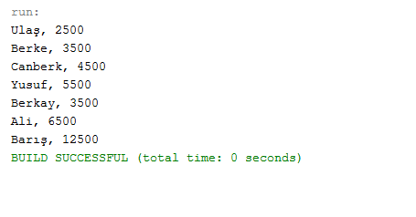

= Composite Pattern

Örneğimde karmaşık olabilecek bir şirket yapısında çalışanların isimlerini ve maaşlarını yazdırmamı sağlayan Composite Pattern içeren bir uygulama yaptım.

== UML

[plantuml, composite-uml-class-diagram, png]
--
@startuml

interface IEmployee{
    + showEmployeeInfo();
}

class Employee{
    - name: String
    - salary: int
    + <<constructor>> Employee(String,int)
    + showEmployeeInfo();
}

class Director{
    - employees: ArrayList<IEmployee>
    + showEmployeeInfo();
    + addEmployee(IEmployee);
    + removeEmployee(IEmployee);
}

Employee ..|> IEmployee
Director ..|> IEmployee

@enduml
--

== Java ile Gerçekleştirme

IEmployee interface

[source,java]
----
public interface IEmployee {
    public void showEmployeeInfo();
}

----

Employee Sınıfı
[source,java]
----
public class Employee implements IEmployee{
    private String name;
    private int salary;
    
    public Employee(String name, int salary){
        this.name = name;
        this.salary = salary;
    }

    @Override
    public void showEmployeeInfo() {
        System.out.println(name + ", " + salary);
    }
    
    
}

----
Director Sınıfı
[source,java]
----
public class Director implements IEmployee{
    
    private ArrayList<IEmployee> employees = new ArrayList<IEmployee>();
    @Override
    public void showEmployeeInfo() {
        for(IEmployee employee: employees){
            employee.showEmployeeInfo();
        }
    }
    
    public void addEmployee(IEmployee employee){
        employees.add(employee);
    }
    public void removeEmployee(IEmployee employee){
        employees.remove(employee);
    }
}

----

== Program Ekran çıktısı
