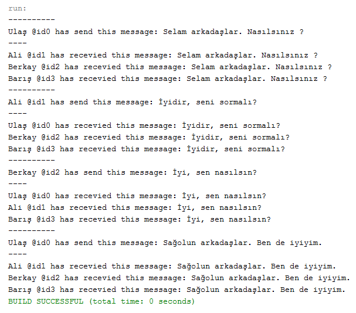

= Mediator Pattern

Bir network ağındaki kullanıcıları ve grupları göz önüne alalım. Kullanıcıların birden fazla gruba dahil olması muhtemeldir. Benzer şekilde bir grup da, kendi içerisinde birden fazla kullanıcı barındırabilir. Yani kullanıcı ve gruplar arasında [underline]#many to many# ilişkisi söz konusudur. Bu aktörler aslında birer nesne olarak dünüldüklerinde, birbirlerine [underline]#sıkı sıkıya bağlı olmaları(Tightly Coupled)#, yönetimlerini zorlaştırmakla kalmaz, ileride yapılacak olan genişletmelerin çok fazla nesneyi etkilemesine de neden olur. Dolayısıyla aralarındaki bağı [underline]#zayıflaştırmak(Loosely Coupled)# gerekir. Bunun için, kullanıcı ve gruplar arasındaki iletişimi, onlardan soyutlayarak kendi içerisinde yönetecek olan bir ara nesneye ihtiyaç vardır. Bu nesne [underline]#mediator# nesnesidir.

Mediator tasarım deseninin kullanım amacındaki odak noktası, nesne kümelerinin birbirleriyle nasıl haberleşebileceğini soyutlayan bir ara nesnenin kullanılmasıdır. 

Mediator(Arabulucu), nesneler arasındaki iletişim karmaşık ancak iyi tanımlandığında iyi bir model seçimidir. Nesneler arasında çok fazla ilişki olduğunda, böyle bir merkezi kontrol noktasına sahip olmayı düşünmenin zamanı gelmiştir.

Mediator ve Observer arasındaki fark genellikle anlaşılmazdır. Çoğu durumda, bu kalıplardan birini uygulayabiliriz; ancak bazen her ikisini de aynı anda uygulayabiliriz.

Mediator'ün temel amacı, bir dizi sistem bileşeni arasındaki karşılıklı bağımlılıkları ortadan kaldırmaktır. Bunun yerine, bu bileşenler tek bir aracı nesneye bağımlı hale gelir. Oberserver'ın amacı, bazı nesnelerin başkalarının astı olarak hareket ettiği nesneler arasında dinamik tek yönlü bağlantılar kurmaktır.

Eğer mediator nesnesi publisher(observer'daki subject) rolünü oynarsa, colleagues(observers) mediator'ün aksiyonlarına abone olur veya abonelikten çıkarsa, bu implementasyon Observer pattern implementasyonu haline gelir.

Bunun yerine tüm bileşenleri kalıcı olarak aynı mediator nesnesine bağlayabiliriz. Bu implementasyon Observer pattern'e benzemez. Ancak yine de bir mediator pattern örneğidir.

== Kendi Örneğimde Mediator Kullanımı

Mediator pattern'i kullanabileceğim bir chat uygulaması geliştirdim. Bu chat uygulamasında bir chat odası bulunmaktadır. Bu odaya birden çok kullanıcı katılabilmektedir.

Normalde tightly coupling ile nesneler arasında iletişim kurulabiliyor. Ancak bu iyi bir yaklaşım değildir. Open/Close prensibine de karşı gelmektedir. Yeni bir nesne eklemek istersem, kodu düzeltmem gerekir. Uygulama büyüdükçe sorun da büyüyecektir.

Bu sorunu çözmek için uygulamamda mediator pattern'i uyguladım.

=== UML Class Diagram

[plantuml, mediator-uml-class-diagram, png]
--
@startuml

interface Mediator{
    + addColleague(Colleague colleague): void
    + removeColleague(Colleague colleague): void
    + send(String message, Colleague colleague): void
}

interface Colleague{
    + send(String message): void
    + receive(String message): void
}

class ConcreteMediator{
    - colleagues: ArrayList<Colleague>
    + <<constructor>> ConcreteMediator()
    + send(String message, Colleague colleague): void
    + addColleague(Colleague colleague)
    + removeColleague(Colleague colleague)
}

class ConcreteColleague{
    - name: String
    - {static} colleagueIDCount: int
    - colleagueID: int
    - mediator: Mediator
    + <<consturctor>> ConcreteColleague(String name, Mediator mediator)
    + send(String message)
    + receive(String message)
}

ConcreteMediator ..|> Mediator
ConcreteColleague ..|> Colleague
Colleague --> Mediator
ConcreteMediator --> ConcreteColleague
@enduml
--

=== Arayüzlerin ve Sınıfların Java ile Gerçekleştirilmesi

Mediator arayüzünde üç adet metod tanımladım. "Colleague" eklemek için "addColleague", "colleague" silmek için "removeColleague" ve mesajları dağıtmak için "send" metodlarını oluşturdum.

[source, java]
--
public interface Mediator {
    public void addColleague(Colleague colleague);
    public void removeColleague(Colleague colleague);
    public void send(String message, Colleague colleague);
}
--

Colleague arayüzünde iki adet metod tanımladım. Mesajı mediator'e iletmesi için "send" ve mediator nesnesinden mesaj alabilmek için "receive" metodlarını oluşturdum.

[source, java]
--
public interface Colleague {
    public void send(String message);
    public void receive(String message);
}
--

Somut mediator nesnesi oluşturmak için "ConcreteMediator" sınıfını oluşturdum. Bu sınıf, Mediator arayüzünü implement ediyor. Eklenen colleague'ları bir ArrayList içerisinde tutuyor. "send" metodu içerisinde bu listedki her bir colleague için colleague arayüzündeki "receive" metodunu çağırıyor.

[source, java]
--
public class ConcreteMediator implements Mediator{
    private ArrayList<Colleague> colleagues;
    
    public ConcreteMediator(){
        colleagues = new ArrayList<Colleague>();
    }
    
    @Override
    public void send(String message, Colleague origin) {
        for(Colleague colleague: colleagues){
            if(colleague != origin){
                colleague.receive(message);
            }
        }
    }

    @Override
    public void addColleague(Colleague colleague) {
        colleagues.add(colleague);
    }

    @Override
    public void removeColleague(Colleague colleague) {
        colleagues.remove(colleague);
    }
    
}
--

Somut colleague nesnesi oluşturmak için "ConcreteColleague" sınıfını oluşturdum. Bu sınıf, "Colleague" arayüzünü implement ediyor. Constructor'ında mediator nesnesi alıyor. "send" metodu içerisinde, bu nesnenin "send" metodunu çağırıyor. Mediator nesnesinden çağrılan "receive" metodu ile aldığı mesajı, kimli ile beraber ekrana basıyor.

[source, java]
--
public class ConcreteColleague implements Colleague{

    private static int colleagueIDCount = 0;
    private int colleagueID;
    private String name;
    
    private Mediator mediator;

    public ConcreteColleague(String name, Mediator mediator) {
        this.mediator = mediator;
        this.colleagueID = colleagueIDCount++;
        this.name = name;
    }
    
    @Override
    public void send(String message) {
        System.out.println("----------");
        System.out.println(name + " @id" + colleagueID + " has send this message: " + message);
        System.out.println("----");
        mediator.send(message, this);
    }

    @Override
    public void receive(String message){
        System.out.println(name + " @id" + colleagueID + " has recevied this message: " + message);
    }

}

--

MediatorPatternDemo sınıfı, yani ana sınıfta, önce mediator için bir instance oluşturuyorum. Sonra, kullanıcılar için ConcreteColleague sınıfından instance'lar oluşturuyorum.

[source, java]
--
public class MediatorPatternDemo {

    public static void main(String[] args) {
        ConcreteMediator chatMediator = new ConcreteMediator();
        ConcreteColleague concreteColleague1 = new ConcreteColleague("Ulaş", chatMediator);
        ConcreteColleague concreteColleague2 = new ConcreteColleague("Ali", chatMediator);
        ConcreteColleague concreteColleague3 = new ConcreteColleague("Berkay", chatMediator);
        ConcreteColleague concreteColleague4 = new ConcreteColleague("Barış", chatMediator);

        chatMediator.addColleague(concreteColleague1);
        chatMediator.addColleague(concreteColleague2);
        chatMediator.addColleague(concreteColleague3);
        chatMediator.addColleague(concreteColleague4);
        
        concreteColleague1.send("Selam arkadaşlar. Nasılsınız ?");
        concreteColleague2.send("İyidir, seni sormalı?");
        concreteColleague3.send("İyi, sen nasılsın?");
        concreteColleague1.send("Sağolun arkadaşlar. Ben de iyiyim.");
    }

}

--

=== Program Çalışmasının Ekran Görüntüsü

Bu ekran görüntüsünden görülebileceği üzere, bir colleague, önce mediator'e mesajını iletiyor. Sonra mediator, daha önce eklenen colleague'lara bu alınan mesajı iletiyor. Yani colleague'ler birbirleri ile doğrudan iletişim kurmuyor. Böyle dinamik bir yapı olmuş oluyor. Şimdi istediğimiz kadar colleague'i kod üzerinde değişiklik yapmadan ekleyebiliriz. Eğer bu prensibi uygulamamış olsaydık, yeni bir colleague eklemek istediğimizde, kod üzerinde değişiklik yapmamız gerekecekti.